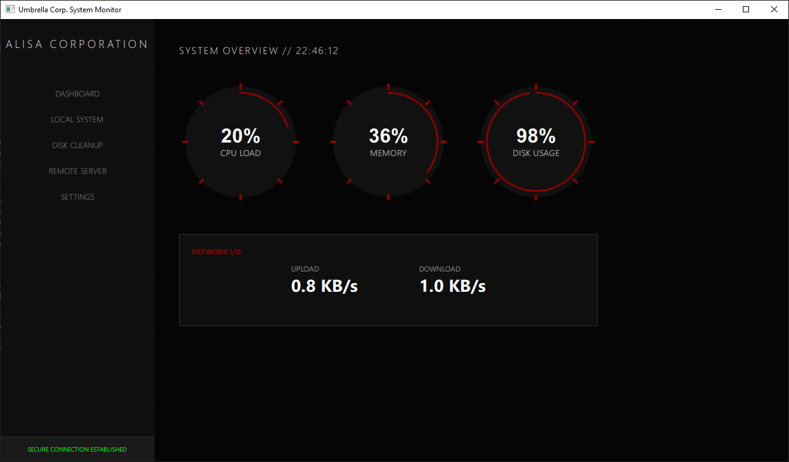

# Alisa Corporation :: System Monitor

A futuristic system monitoring dashboard with a sleek dark theme and crimson accents, built with Qt 6 for high-performance cross-platform monitoring.



## Features

### 🖥️ **Local System Monitoring**
- **Real-time Metrics**: CPU, RAM, Disk usage, and Network I/O
- **Cross-platform**: Windows, Linux, and macOS support
- **Background Threading**: Non-blocking data collection for smooth UI
- **Circular Gauges**: Beautiful animated progress indicators

### 🧹 **Disk Cleanup Analyzer**
- **Smart Scanning**: Detects node_modules, build artifacts, and cache files
- **Safety Checks**: 30-day age filter and system directory exclusion
- **Sortable List**: Sort by size, date, or type (ascending/descending)
- **One-click Cleanup**: Safe deletion with path validation

### 🌐 **Remote Server Monitoring**
- **SSH-based Connections**: Monitor unlimited remote servers
- **Multi-server Dashboard**: View all servers at a glance
- **Auto-refresh**: Live stats every 5 seconds
- **Persistent Storage**: Server credentials saved automatically
- **Connection Status**: Real-time indicators and error handling

### 🎨 **UI/UX**
- **Dark Theme**: Deep black (#050505) with crimson accents (#8B0000)
- **Glowing Effects**: Smooth animations and hover feedback
- **Responsive Layout**: Modular sidebar navigation
- **Professional Typography**: Clean, modern fonts with proper spacing

## Requirements
- Qt 6.8 or higher
- CMake 3.16+
- C++20 compatible compiler
- **sshpass** (for remote server password authentication)
  - Arch Linux: `sudo pacman -S sshpass`
  - Ubuntu/Debian: `sudo apt install sshpass`
  - Fedora: `sudo dnf install sshpass`
  - macOS: `brew install hudochenkov/sshpass/sshpass`

## Build Instructions
```bash
mkdir build
cd build
cmake ..
cmake --build .
```

## Project Structure

### Backend (C++)
- **SystemMonitor.h/cpp**: Local system metrics collection with background worker
- **DiskAnalyzer.h/cpp**: Disk scanning and cleanup engine
- **ServerManager.h/cpp**: SSH-based remote server monitoring
- **main.cpp**: Application entry point and QML type registration

### Frontend (QML)
- **Main.qml**: Main application layout and view stack
- **Sidebar.qml**: Navigation sidebar with menu items
- **StatCircle.qml**: Reusable circular gauge component
- **DiskCleanup.qml**: Disk cleanup analyzer interface
- **RemoteMonitor.qml**: Remote server list and monitoring view

### Build System
- **CMakeLists.txt**: CMake configuration for Qt 6
- **PROJECT_STATUS.md**: Development progress and roadmap
